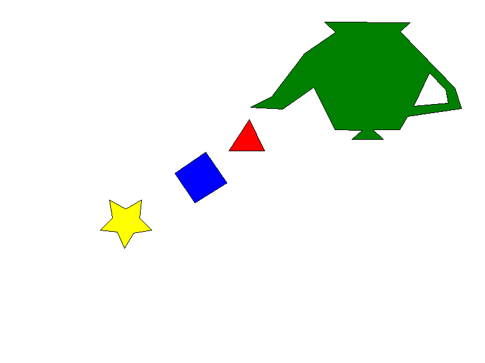

# Luis Alejandro Hernandez Marquez (241424)
# Laboratorio 1: Scanline Fill
# prof. Pablo Koch

## Algoritmos implementados
- Bresenham para dibujar los bordes de los polígonos.
- Scanline Fill con cálculo y ordenamiento de intersecciones.
- Regla par-impar para polígonos cóncavos y contornos con agujeros.


## Ejecución

Se requiere Rust y Cargo. Desde la raíz del proyecto ejecutar:

```bash
cargo run
```

Al finalizar se crea `out.png` en la raíz del proyecto con una resolución de
800 × 600 píxeles.

## Resultado


